# 🚀 Muhammad Bilal Qur3Sh1
### `Data Engineer | Mobile App Developer | Analytics Architect`

<div align="center">
  
```ascii
╔══════════════════════════════════════════════════════════════╗
║  ████▄ ▄▄▄▄▄ ▄▄▄▄▄ ▄▄▄▄▄    ████▄    ▄   ▄▄▄▄▄ ▄▄▄▄▄ ████▄  ║
║  █   █   █   █   █ █   █    █   █     █  █   █ █   █ █   █  ║
║  █   █   █   █▄▄▄█ █▄▄▄▄    █   █ ██   █ █   █ █▄▄▄█ █   █  ║
║  █   █   █   █   █ █   █    █   █ █ █  █ █   █ █   █ █   █  ║
║  █████   █   █   █ █   █    █████ █  █ █ █████ █   █ █████  ║
╚══════════════════════════════════════════════════════════════╝
```

</div>

---

## 🔬 **CORE ARCHITECTURE**

```mermaid
graph TD
    A[🗃️ Data Sources] -->|Extract| B[🔄 ETL Pipeline]
    B -->|Transform| C[⚡ Processing Engine]
    C -->|Load| D[🏛️ Data Warehouse]
    D --> E[📊 Analytics Layer]
    E --> F[📱 Mobile Interface]
    
    style A fill:#0f3460
    style B fill:#16537e
    style C fill:#1a759f
    style D fill:#168aad
    style E fill:#34a0a4
    style F fill:#52b788
```



---

## ⚡ **DATA ENGINEERING ARSENAL**

<table>
<tr>
<td width="50%">

### 🏗️ **ETL & PROCESSING**
```yaml
Core_Technologies:
  - Pentaho Data Integration ⭐⭐⭐⭐⭐
  - Advanced SQL Queries ⭐⭐⭐⭐⭐
  - Data Pipeline Orchestration ⭐⭐⭐⭐
  - Real-time Stream Processing ⭐⭐⭐⭐
```

### 📊 **ANALYTICS & VISUALIZATION**
```yaml
Business_Intelligence:
  - Tableau Dashboard Design ⭐⭐⭐⭐⭐
  - Interactive Data Stories ⭐⭐⭐⭐
  - KPI Performance Tracking ⭐⭐⭐⭐
  - Executive Reporting ⭐⭐⭐⭐
```

</td>
<td width="50%">

### 🗄️ **DATA INFRASTRUCTURE**
```yaml
Database_Systems:
  - PostgreSQL/MySQL ⭐⭐⭐⭐⭐
  - Data Warehousing ⭐⭐⭐⭐
  - Query Optimization ⭐⭐⭐⭐⭐
  - Database Performance Tuning ⭐⭐⭐⭐
```

### 📱 **MOBILE DEVELOPMENT**
```yaml
React_Native_Stack:
  - Cross-platform Apps ⭐⭐⭐⭐
  - Data-driven UIs ⭐⭐⭐⭐
  - Real-time Analytics ⭐⭐⭐⭐
```

</td>
</tr>
</table>

---

## 🌊 **DATA FLOW EXPERTISE**

<div align="center">

```
┌─────────────┐    ┌─────────────┐    ┌─────────────┐    ┌─────────────┐
│   EXTRACT   │───▶│  TRANSFORM  │───▶│    LOAD     │───▶│   ANALYZE   │
│             │    │             │    │             │    │             │
│ • Web APIs  │    │ • Cleansing │    │ • Warehouse │    │ • Dashboards│
│ • Databases │    │ • Validation│    │ • Data Lake │    │ • Reports   │
│ • Files     │    │ • Enrichment│    │ • Real-time │    │ • Insights  │
└─────────────┘    └─────────────┘    └─────────────┘    └─────────────┘
```

</div>

---

## 💼 **PROFESSIONAL FOCUS**

<div align="center">

| 🎯 **SPECIALIZATION** | 🔧 **IMPLEMENTATION** | 📈 **IMPACT** |
|:---:|:---:|:---:|
| ETL Pipeline Architecture | Pentaho Kettle, Custom Scripts | Automated 95% of data workflows |
| Business Intelligence | Tableau, Advanced SQL | Real-time executive dashboards |
| Mobile Analytics | React Native, Data APIs | Cross-platform data solutions |
| Performance Optimization | Query tuning, Index strategies | 300% faster data processing |

</div>

---

## 🎓 **ACADEMIC FOUNDATION**
```
🏛️ Bachelor of Science in Computer Science (BSCS)
   ├── Advanced Database Systems
   ├── Data Structures & Algorithms
   ├── Software Engineering Principles
   └── Mobile Application Development
```

---

## 🤝 **COLLABORATION OPPORTUNITIES**

<div align="center">

```
╭─────────────────────────────────────────────────────────╮
│                                                         │
│  🏢 Enterprise Data Solutions                           │
│  📊 Business Intelligence Projects                      │
│  📱 Data-Driven Mobile Applications                     │
│  🔄 ETL Pipeline Optimization                           │
│  📈 Analytics Dashboard Development                     │
│                                                         │
╰─────────────────────────────────────────────────────────╯
```

</div>

---

## 📡 **CONNECT & COLLABORATE**

<div align="center">

[](https://www.linkedin.com/in/muhammad-bilal-qureshi-52236528a)
[](mailto:muhammadbilalqureshi31@gmail.com)

</div>

---

<div align="center">

```
┌─────────────────────────────────────────────────────────────┐
│                                                             │
│    "Transforming Raw Data into Strategic Intelligence"     │
│                                                             │
└─────────────────────────────────────────────────────────────┘
```

**`Building the future of data-driven decision making, one pipeline at a time`**

</div>
